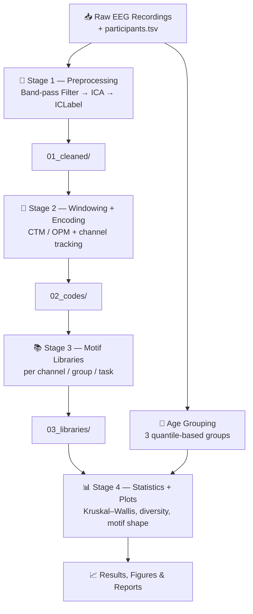

<div align="center">


<p>
  
  
  
  
  
  
</p>

<p>
  
  
  
</p>

</div>

---

## 📖 Overview

**EEG Age Patterns** is a research project that investigates how brain activity changes
during childhood and adolescence by discovering **recurring symbolic patterns — motifs —**
in raw EEG recordings.

Instead of relying only on classical frequency-band power, this project converts EEG time
series into **symbolic sequences** using two custom encoders, builds a **motif library** per
electrode channel, and then asks a statistical question:

> **Do the motifs that dominate a child's EEG differ measurably from those of an adolescent?**

The result is a complete, reproducible **four-stage pipeline** — from raw recordings through
artifact removal, encoding, motif extraction, and statistical testing — plus the plots and
reports needed to interpret the findings.

---

## 🎯 Research Objective

| | |
|---|---|
| **Question** | Are there brainwave motifs whose prevalence changes systematically with age? |
| **Population** | Children and adolescents |
| **Grouping** | Participants split into **3 equal age groups** by quantiles (from `participants.tsv`) |
| **Unit of analysis** | Per **EEG channel**, per **age group**, per **task** |
| **Statistical test** | **Kruskal–Wallis** H-test (non-parametric, 3-group comparison) |

---

## 🧬 Pipeline Architecture



---

## 🔬 Methods

### 1️⃣ Preprocessing — Cleaning the Signal

Raw EEG is dominated by artifacts: eye blinks, muscle tension, line noise, and electrode drift.
Stage 1 removes them automatically:

- **Band-pass filtering** to retain the physiologically meaningful frequency range
- **ICA (Independent Component Analysis)** to decompose the signal into independent sources
- **ICLabel** (`mne-icalabel`) to *automatically classify* each component as brain, eye, muscle,
  heart, line-noise, or channel-noise — so artifact rejection is reproducible rather than manual
- Cleaned recordings are written to `01_cleaned/`

### 2️⃣ Symbolic Encoding — From Waveforms to Words

The core idea: a continuous EEG window is reduced to a short **symbol**, so that repeated
patterns become countable. Two independent encoders are implemented, each with **unit tests**:

<table>
<tr><th width="50%">🌳 CTM — Parent-Distance</th><th width="50%">🔢 OPM — Natural Representation</th></tr>
<tr valign="top">
<td>

Encodes each window by its **structural relationship to a parent node**, capturing the
hierarchical shape of the waveform segment rather than its raw amplitude.

</td>
<td>

Encodes each window by the **ordinal pattern** of its samples — the relative ordering of
values, which makes the representation robust to amplitude scaling and drift.

</td>
</tr>
</table>

Signals are **z-score normalized** before encoding, so that inter-subject amplitude differences
do not contaminate the comparison. Channel identity is tracked throughout, and encoded output
is written to `02_codes/`.

### 3️⃣ Motif Libraries

For every **channel × age group × task** combination, the pipeline builds a library of the
symbolic motifs that occur, along with their frequencies — stored in `03_libraries/`.

**Window-length grid search:** the window length `L` is not guessed. A dedicated grid-search
stage sweeps candidate values and selects the length that yields the most informative and
consistent motif structure.

### 4️⃣ Statistics & Visualization

- **Kruskal–Wallis H-test** per channel — a non-parametric test appropriate for comparing three
  independent groups without assuming normality
- **Motif diversity** plots per channel
- **Motif shape** plots, including **mean ± std** envelopes
- **Motif frequency** per channel, reported as the **median percentage across subjects**
  (median chosen over mean for robustness to outlier participants)
- Window-length consistency verification across the dataset

---

## 📂 Repository Contents

| File | Description |
|---|---|
| 📓 `EEG_Pipeline_Final_Project_TASKs.ipynb` | **The complete pipeline** — all 4 stages, encoders, unit tests, statistics and plots |
| 📘 `Project_Book_phaseB.pdf` | Full project book (Phase B) — background, design, implementation, results |
| 📗 `Final Project – Phase A (61998).pdf` | Phase A report — research proposal, literature review, methodology |
| 📊 `EEG_Full_Results.docx` | Complete results write-up |
| 🖼️ `EEG_Poster_B.pdf` | Research poster |
| 🎬 `Demo_Project.mp4` | Video demonstration of the pipeline in action |
| 🖥️ `EEG_Brain_Development_Presentation.pptx` | Project presentation slides |
| 📕 `User_Guide_EEG_Pipeline_Project.pdf` | **User guide** — how to operate the pipeline |
| 🔧 `Maintenance_Guide_EEG_Pipeline_PhaseB_project.pdf` | **Maintenance guide** — how to extend and maintain the code |

---

## 🚀 Getting Started

### Option A — Google Colab (recommended)

The notebook is built for Colab and mounts Google Drive for data storage.

1. Open `EEG_Pipeline_Final_Project_TASKs.ipynb` in [Google Colab](https://colab.research.google.com/)
2. Run **Cell 1** — installs dependencies, mounts Drive, and defines all paths and parameters
3. Point the path variables at your EEG dataset (must include `participants.tsv`)
4. Run the cells **in order** — each stage writes its output to disk, so stages can be resumed
   independently without recomputing earlier ones

### Option B — Local Jupyter

```bash
pip install mne mne-icalabel numpy scipy pandas matplotlib
jupyter notebook EEG_Pipeline_Final_Project_TASKs.ipynb
```

> **Note:** replace the `google.colab` Drive-mount cell with a local path to your dataset.

### 💡 Tips

- **Stage outputs are cached** in `01_cleaned/`, `02_codes/` and `03_libraries/`. A dedicated
  cleanup cell clears Stage 2 and 3 outputs while preserving the expensive Stage 1 results.
- **Stage 1 is the slow step** (ICA is computationally heavy) — run it once, then iterate freely
  on encoding and statistics.
- Consult the **User Guide** for operating instructions and the **Maintenance Guide** before
  extending the code.

---

## 🛠️ Tech Stack

<div align="center">

| Category | Tools |
|---|---|
| **Language** | Python 3 |
| **EEG Processing** | `mne`, `mne-icalabel` (ICA + automatic component labelling) |
| **Scientific Computing** | `numpy`, `scipy` (`kruskal`, `zscore`) |
| **Data Handling** | `pandas`, `pickle`, `glob` |
| **Visualization** | `matplotlib` |
| **Environment** | Jupyter Notebook · Google Colab |

</div>

---

## 📌 Key Highlights

- ✅ **End-to-end reproducible pipeline** — raw signal to statistical conclusion, in ordered stages
- ✅ **Two independent symbolic encoders**, each covered by **unit tests**
- ✅ **Automated artifact rejection** via ICA + ICLabel, removing manual subjectivity
- ✅ **Data-driven hyperparameter selection** through window-length grid search
- ✅ **Statistically grounded** — non-parametric testing suited to the data's distribution
- ✅ **Fully documented** — project book, user guide, maintenance guide, poster and demo video

---

## 👤 Author

**Wadiea Farran**
Software Engineering — Braude College of Engineering

<a href="https://github.com/wadiea1">
  
</a>

---

<div align="center">
</div>
